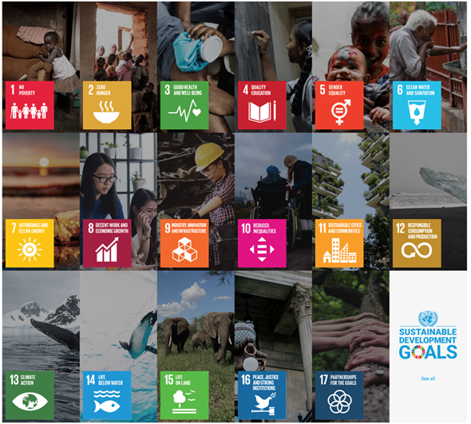

# Relevance to Sustainable Development Goals

**Source** -   

The Marine Spatial Planning (MSP) platform for Puducherry aims to provide free and open access to geospatial datasets, supporting evidence-driven decision-making for sustainable marine and coastal resource management. By leveraging geospatial analysis and data-driven approaches, the platform facilitates informed policy-making and coordinated actions among stakeholders involved in marine conservation, fisheries management, coastal infrastructure development, and climate adaptation strategies.

## The platform plays a critical role in:

- **Sustainable marine resource utilization**, ensuring optimal use of coastal and ocean spaces while preserving biodiversity.
- **Climate resilience and adaptation**, integrating real-time environmental data to mitigate risks from sea-level rise, extreme weather events, and habitat degradation.
- **Infrastructure planning**, aiding the development of climate-resilient ports, coastal cities, and marine tourism.
- **Reducing conflicts between marine industries** such as fisheries, tourism, shipping, and conservation efforts by providing data-driven insights for spatial planning.

By combining scientific research, community knowledge, and digital innovations, the MSP platform ensures that marine governance aligns with sustainable development principles, leading to better resource management, disaster risk reduction, and economic benefits for coastal communities.

## Contribution to Sustainable Development Goals (SDGs)

The MSP platform contributes to three SDG goals, namely:

- **Goal 14**: Conserve and sustainably use the oceans, seas, and marine resources for sustainable development.
- **Goal 13**: Take urgent action to combat climate change and its impacts.
- **Goal 15**: Protect, restore, and promote sustainable use of terrestrial ecosystems, sustainably manage forests, combat desertification, and halt and reverse land degradation and halt biodiversity loss.
- **Goal 9**: Build resilient infrastructure, promote inclusive and sustainable industrialization, and foster innovation.
- **Goal 11**: Make cities and human settlements inclusive, safe, resilient, and sustainable.

### The specific targets and indicators that the platform contributes to are detailed below:

| **SDG Goal**               | **SDG Target**                                                                                                                                                  | **SDG Indicator**                                                                                                     |
|---------------------------|----------------------------------------------------------------------------------------------------------------------------------------------------------------|----------------------------------------------------------------------------------------------------------------------|
| **14. Life Below Water**  | **14.2**: By 2020, sustainably manage and protect marine and coastal ecosystems to avoid significant adverse impacts, and take action for their restoration.  | **14.2.1**: Proportion of national exclusive economic zones managed using ecosystem-based approaches.               |
|                           | **14.5**: By 2020, conserve at least 10 percent of coastal and marine areas, consistent with national and international law.                                    | **14.5.1**: Coverage of protected areas in relation to marine areas.                                                 |
|                           | **14.7**: By 2030, increase the economic benefits to small island developing states and least developed countries from the sustainable use of marine resources. | **14.7.1**: Sustainable fisheries as a proportion of GDP in small island developing states, least developed countries, and all countries. |
| **13. Climate Action**    | **13.1**: Strengthen resilience and adaptive capacity to climate-related hazards and natural disasters in all countries.                                       | **13.1.2**: Number of countries that adopt and implement national disaster risk reduction strategies.                 |
| **15. Life on Land**      | **15.1**: By 2020, ensure the conservation, restoration, and sustainable use of terrestrial and inland freshwater ecosystems.                                   | **15.1.1**: Forest area as a proportion of total land area.                                                           |
|                           | **15.5**: Take urgent and significant action to reduce the degradation of natural habitats, halt biodiversity loss, and prevent species extinction.           | **15.5.1**: Red List Index.                                                                                          |
| **9. Industry, Innovation, and Infrastructure** | **9.1**: Develop quality, reliable, sustainable, and resilient infrastructure.                                        | **9.1.1**: Proportion of the rural and coastal population who have access to sustainable infrastructure.             |
|                           | **9.4**: By 2030, upgrade infrastructure and retrofit industries to be sustainable.                                        | **9.4.1**: CO₂ emissions per unit of value added in coastal and marine industries.                                   |
| **11. Sustainable Cities and Communities** | **11.4**: Strengthen efforts to protect and safeguard the world’s cultural and natural heritage.                     | **11.4.1**: Total expenditure per capita spent on preservation, protection, and conservation of marine and coastal heritage. |
|                           | **11.5**: By 2030, reduce deaths and economic losses due to disasters, including water-related disasters.                     | **11.5.2**: Direct economic loss in relation to global GDP, damage to critical infrastructure, and service disruptions due to coastal disasters. |

By aligning marine spatial planning with global sustainability goals, this platform empowers governments, local communities, and industries to create a resilient, sustainable, and economically vibrant coastal ecosystem.
