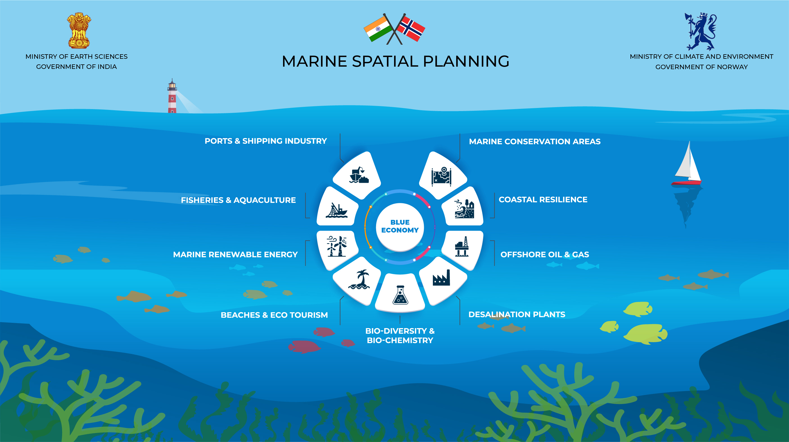

# MSP-SAHAV  
**Marine Spatial Planning for Puducherry, India**  
  

## Meets Digital Public Good Eligibility Criteria  
The **Puducherry Geo MSP portal** aligns with multiple **United Nations Sustainable Development Goals (SDGs)**, primarily:  

### 🌊 SDG 14 - Life Below Water  
- **Target 14.2**: Sustainably manage and protect marine and coastal ecosystems.  
- **Target 14.5**: Conserve at least 10% of coastal and marine areas.  

### 🌍 SDG 13 - Climate Action  
- MSP enhances climate resilience by planning for coastal adaptation and mitigating sea-level rise impacts.  

### 🌱 SDG 15 - Life on Land  
- MSP integrates coastal zone management, protecting mangroves, seagrass, and wetlands.  

### 🏙️ SDG 11 - Sustainable Cities and Communities  
- Supports coastal urban planning, reducing the environmental impacts of coastal development.  

### 🏗️ SDG 9 - Industry, Innovation, and Infrastructure  
- Facilitates sustainable maritime infrastructure, including ports, offshore wind farms, and aquaculture.  

---

## GIS Website Template  
This repository provides a **template** for hosting GIS layers using **Leaflet** and **GeoServer**. It allows users to easily add **Web Map Service (WMS) layers** and customize their own GIS applications.  

### **Features**  
✔️ Interactive map with **Google Maps** or **ESRI Maps** as the base layer.  
✔️ Supports **WMS and WFS layers** from GeoServer.  
✔️ Dynamic layer management using JavaScript.  
✔️ Customizable styles for vector and raster layers.  
✔️ Visualization of regional statistics.  
✔️ Dynamically built and customizable UI components.  
✔️ Open-source and easily extendable.  

---

## Prerequisites  
- A web server (e.g., Python HTTP server, VS Code Live Server, or IIS for deployment).  
- [GeoServer](https://geoserver.org/) installed and running.  
- [QGIS](https://qgis.org/en/site/) for styling layers (optional).  
- Basic knowledge of **JavaScript, HTML, and CSS**.  
- Understanding of **hosting vector and raster files in GeoServer**. (Follow instructions in `/Backend/geoserver_setup_and_host_services.md`.)  

---

## Installation  

### **1️⃣ Clone the Repository**  
```sh
git clone https://github.com/nccrmoes/MSP-SAHAV.git
cd MSP-SAHAV


## 2. Set up a web server (for local testing)

### Option 1
If you are using Python, run:
```sh
python -m http.server 8080
```
Then open `http://localhost:8080/map.html` in your browser.

### Option 2
If you are using Node.js
cd path\to\your\project

npm install -g http-server

http-server -p 8000

Then Open http://localhost:8000/map.html in your browser.

### Option 3
Copy the extracted folder in /inetpub/wwwroot/MAP-SAHAV
add a virtual application in IIS pointing to this folder.
Browse map.html from IIS which http://localhost:port/map.html in browser

### 3. Configure GIS Layers
Edit the `main.js` file to add your GeoServer WMS and WFS layer URLs:
```js
var WMS_LAYER_URL = "https://your-geoserver-url/geoserver/wms";
var WFS_LAYER_URL = "https://your-geoserver-url/geoserver/wfs";
```

## Contributing
Feel free to fork this repository and contribute with improvements, fixes, or additional features.

## License
This project is open-source under the Apache 2.0 License.

## Support
For issues or questions, open a GitHub issue or contact us at `nccrmoeschennai@gmail.com`.
